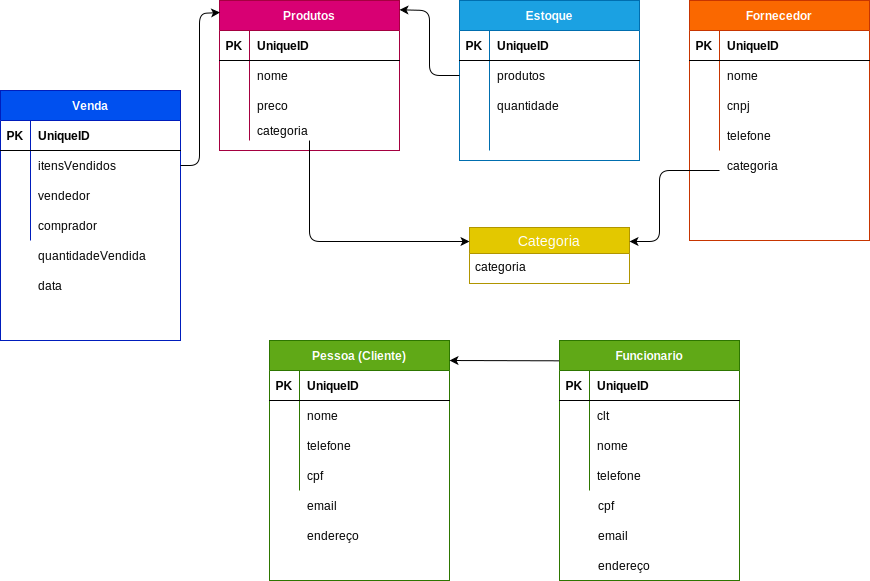

# pygrocery-store

**PyGrocery Store** is my personal grocery store management project in Python Language.

My intention in this project is to practice what I'm learning and create somethjing with my Python studies

Here you will find some concepts implemented such as OOP, MVC among others

Some features:

- Inventory control
- Registration of Suppliers
- Customer base
- Product category
- Sales Control
- Sales Report

# Data Model

This is the initial data structure.

In this project I will work storing data in text files and maybe migrate to some SGDB in the future

 
 
 
 

